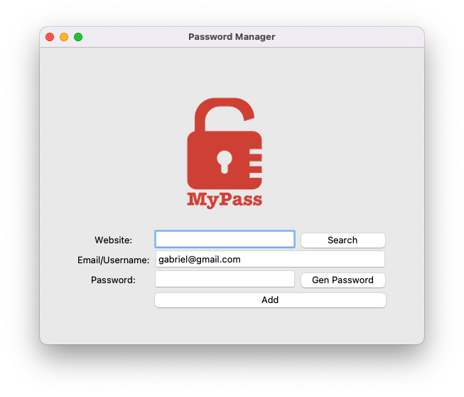
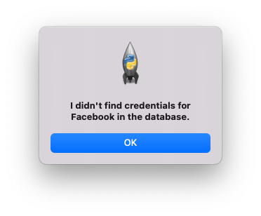

# MyPass.py

Part of my #100DaysOfCode challenge, this project is a password manager app that uses the **tkinter** module for 
graphical user interface, **random** for generating strong randomized passwords and **json** for storing data.

The main objective with MyPass was to put into practice error handling techniques such as **try**, **except**, **else**, 
**finally** and **raise**. These techniques are useful for dealing with scenarios where the program would have otherwise 
crashed. For example, if the user searches for credentials for their "Facebook" account and there is no such password in
the database, the program raises the error below.

