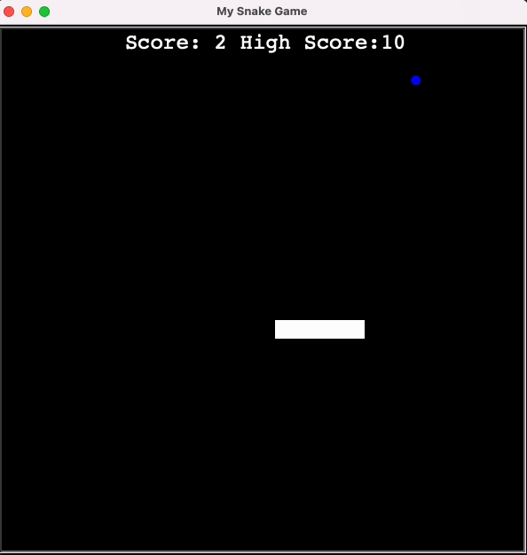

# Snake.py

This project attempts to replicate the classic Snake game using the **turtle** module in Python.

Part of *#100DaysOfCode* challenge, the game encapsulates a series of core Python concepts such as data structures, loops, 
select statements, file management, functions and object oriented programming (OOP).

Just like the classic game, the snake is controlled by the *up*, *down*, *left* and *right* keys, and each time the snake 
reaches the food, the snake's tail grows longer and a new food is generated at a random location in the screen. 

The game also keeps track of the historical high score, so feel free to try to beat mine! 

